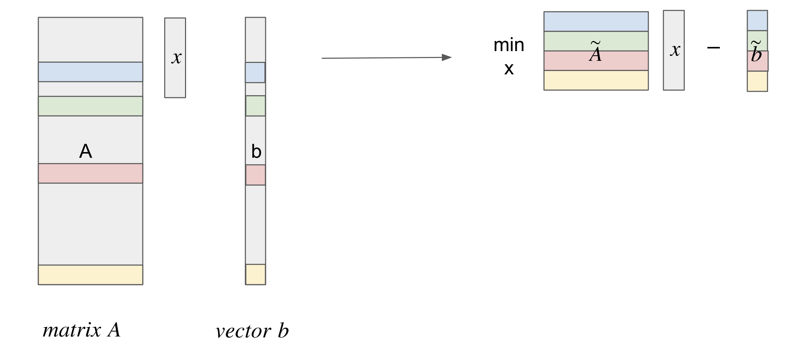

# Coreset-based logistic regression for atlas-scale cell type annotation
   

### Dataset Access
Click [here](https://drive.google.com/drive/folders/1mj5txQ_L_9jYs397UxSTcA4L_7xPyaBG?usp=share_link) to access the datasets: hECA, Simonson LV, Macosko Mouse Brain.

### Folder Explaination
- [**implementation_CellTypist**](implementation_CellTypist): Contains code related to implementing CellTypist, a model for cell type classification. We use default parameters with batch_number=100 and batch_size=1000 and set se_SGD = True,mini_batch = True to train our own CellTypist model with hECA data. 

- [**implementation_scMulan**](implementation_scMulan): Contains code related to implementing [scMulan](https://github.com/SuperBianC/scMulan), a pre-trained langauge model for cell type classification.

- [**our_coreset_log_reg**](our_coreset_log_reg): Contains code of our coreset logistic regression algorithm, and its implmentation on training and testing on the same dataset as well as its implementation on training with hECA and testing on LV dataset.

- [**our_get_mu**](our_get_mu): Contains code in solving a linear programming problem with Gurobi in order to find a complexity measure for a dataset.

