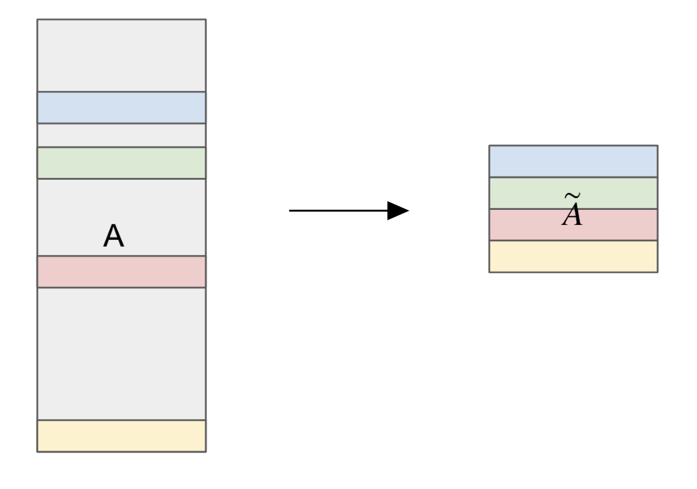

# Coreset-based logistic regression for atlas-scale cell type annotation
   

## Coreset-Based Logistic Regression

In this project, we utilize a **coreset** approach to perform **Logistic Regression** efficiently on large datasets. Instead of running logistic regression on the entire dataset, we uniformly sample a subset of rows (the "coreset") from the original data matrix. This coreset is a smaller representative subset that preserves the essential characteristics of the full dataset, ensuring that the **log loss is approximately preserved** when training on the coreset.

### Why Use a Coreset?
By reducing the dataset size while maintaining its essential structure, we achieve faster computation with minimal loss in accuracy. This approach is especially useful for large-scale data, where directly training on the full dataset may be computationally prohibitive.

### Coreset Illustration Diagram
The following diagram illustrates the coreset sampling process, where selected rows (highlighted) represent the coreset extracted from the original matrix:



The coreset-based logistic regression preserves key properties of the data, providing an efficient alternative to training on the entire dataset.

### Dataset Access
Click [here](https://drive.google.com/drive/folders/1mj5txQ_L_9jYs397UxSTcA4L_7xPyaBG?usp=share_link) to access the datasets: hECA, Simonson LV, Macosko Mouse Brain.

### Folder Explaination
- [**implementation_CellTypist**](implementation_CellTypist): Contains code related to implementing [CellTypist](https://github.com/Teichlab/celltypist), a model for cell type classification. We use default parameters with batch_number=100 and batch_size=1000 and set se_SGD = True,mini_batch = True to train our own CellTypist model with hECA data. 

- [**implementation_scMulan**](implementation_scMulan): Contains code related to implementing [scMulan](https://github.com/SuperBianC/scMulan), a pre-trained langauge model for cell type classification.

- [**our_coreset_log_reg**](our_coreset_log_reg): Contains code of our coreset logistic regression algorithm, and its implmentation on training and testing on the same dataset as well as its implementation on training with hECA and testing on LV dataset.

- [**our_get_mu**](our_get_mu): Contains code in solving a linear programming problem with Gurobi in order to find a complexity measure for a dataset.

### Getting Started
This project is compatible with IDEs like **PyCharm**, **VS Code**, and others that support Python development. You can follow these steps to get started in PyCharm:

1. **Clone the Repository**:
```bash
git clone https://github.com/danrongLi/coreset_based_log_reg.git
cd coreset_based_log_reg

2. **Open in PyCharm**:
   - Open PyCharm.
   - Go to `File > Open` and select the project directory.

3. **Locate the Main Script**:
   - In the project directory, locate the main `.py` file that you want to run.

4. **Run the Script**:
   - Right-click on the script and select `Run` (or press the play button in PyCharm).
   - The results will be displayed in the console.

